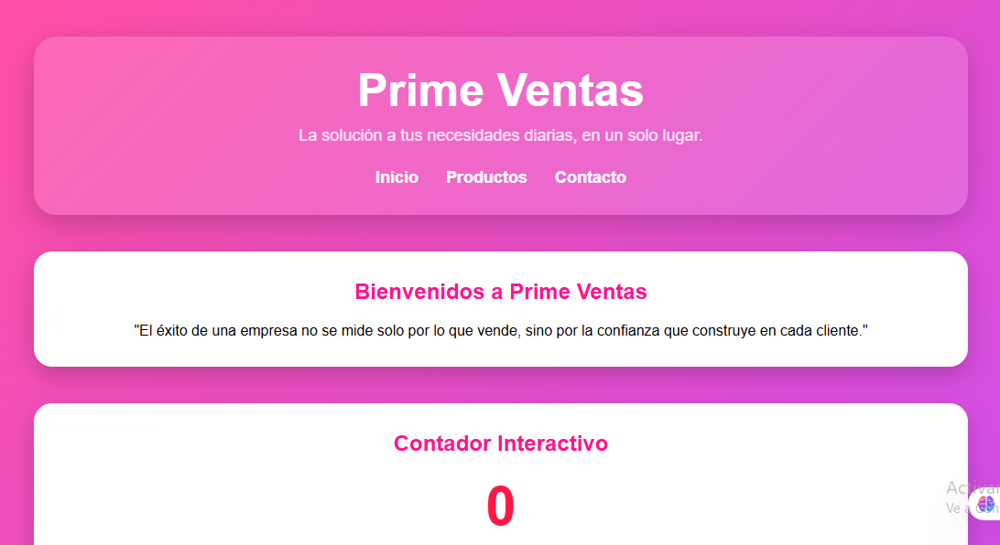
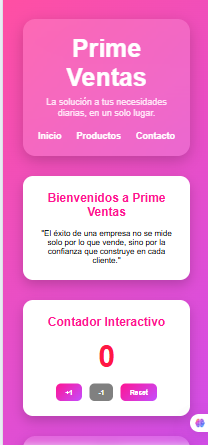
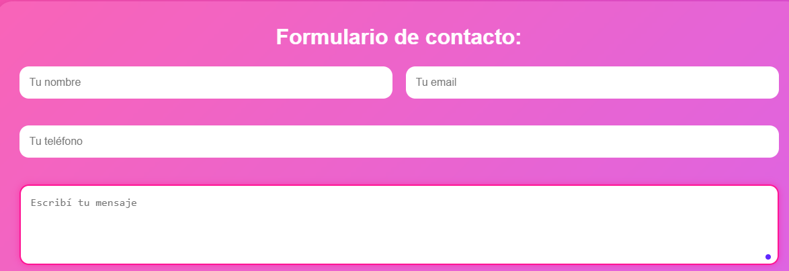

# Prime Ventas
Aplicación web desarrollada con React y Vite.  
Simula una tienda tecnológica moderna con productos, formulario de contacto, contador interactivo y lista de tareas.

## Tecnologías utilizadas
* React
* Vite
* JavaScript
* CSS3

### Instrucciones
* Paso 1: Descargar o clonar el proyecto
Descargar el proyecto y abrir la carpeta en Visual Studio Code.
* Paso 2: Abrir la terminal
En Visual Studio Code, abrir la terminal desde:
Terminal > New Terminal
* Paso 3: Instalar las dependencias
Ejecutar el siguiente comando para instalar todas las dependencias necesarias:
bash
npm install
* Paso 4: Ejecutar el proyecto
Una vez terminada la instalación, ejecutar:
bash
npm run dev
* Paso 5: Abrir la aplicación
La terminal mostrará un enlace similar al siguiente:
bash
http://localhost:5173/
## Funcionalidades
* Header y Footer reutilizables
* Cards de productos reutilizables con props
* Contador interactivo con useState
* Formulario controlado con preview en vivo
* Lista de productos con filtros
* To-Do App completa (CRUD)
* Diseño responsive y moderno
* Navegación dinámica entre secciones

## Capturas de pantalla

### Disposicion Desktop

### Disposicion Phone

### Focus

### Proyecto 
https://tp6-react-6hja6vs4z-daniela-camacho-s-projects.vercel.app/