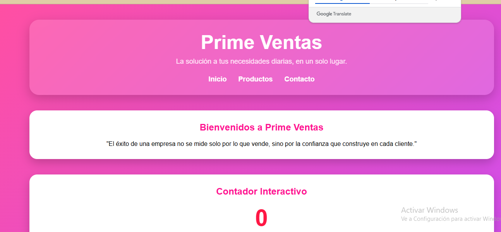
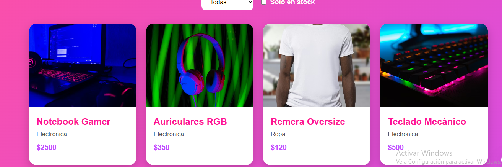
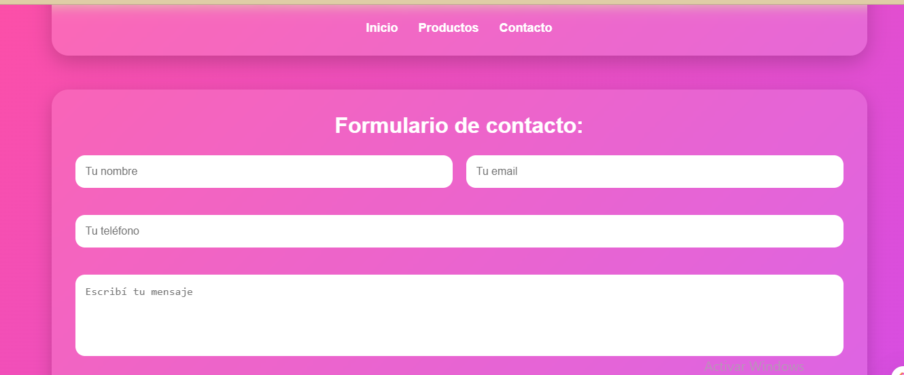
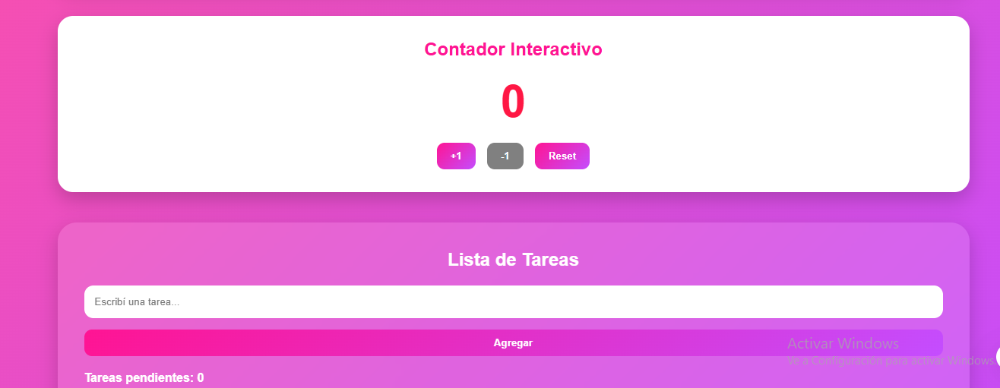

# Prime Ventas
Aplicación web desarrollada con React y Vite.  
Simula una tienda tecnológica moderna con productos, formulario de contacto, contador interactivo y lista de tareas.

## Tecnologías utilizadas
* React
* Vite
* JavaScript
* CSS3

## Funcionalidades
* Header y Footer reutilizables
* Cards de productos reutilizables con props
* Contador interactivo con useState
* Formulario controlado con preview en vivo
* Lista de productos con filtros
* To-Do App completa (CRUD)
* Diseño responsive y moderno
* Navegación dinámica entre secciones

## Capturas de pantalla

### Inicio

### Productos

### Contacto

### Todo App

### Proyecto 
http://localhost:5174/
